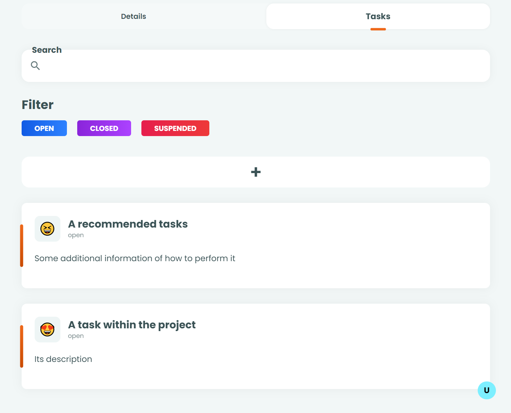

# Process of using the app

This part of the documentation gives you some hints of you can use the app.

## 1) Authorization and getting started

To use the application, the user first has to create an account and login. This can be done by clicking on "Get started" directly on the landing page.

After that you can either login with your credentials or create a new account by clicking on "you don't have an account?". After creating a new account, the user has to join a team. This can be done by either creating a new one or asking another team to let them join theirs. For the second options, the user has to give another team member his username, which can be used to add someone else into a team.

## 2) Teams page

First, let's have a look at the teams page. This page can be accessed by either clicking at the link in the sidebar or by on mobile on the quick navigation at the bottom. Generally, it shows you information about the teams you are in. By selecting one of the teams in the dropdown (click on the name of the team) you can show specific information about it. For example, the amount of projects and members, as well as all its members + their roles and the stats of the team. The page also gives the possibility to create a new team and leave the current one (if you are in at least 2 teams.)

### Members

Team members have a role, which is used to identify their position and experience. It can be used for the automatic finding of members to execute a task. By clicking on the + sign, new members can be added to the team using their usernames. By clicking on the dropdown in the top-right corner of each member, their role can be changed.

In this popup you can create a new role by giving it a custom name after clicking on the + sign. Roles can only be deleted if it is not used in within the team.

### Stats

By switching to the Stats tab, general statistics (if there are any) are shown, such as the relative completion of all projects and recent activities.

## 3) Projects page

The projects page is used to create new projects and manage them. On that page, you can search through your projects and filter them. By clicking on the + of the list, you can create a new project.

### Detail page

By clicking on one of such projects, you are moved to its detail page, where general information is displayed. Here you are able to look at graphs that display information about the project and create new tasks. By clicking on the tag in the top-left corner you can change the status directly on the detail page.

### Tasks list

When switching to the Tasks tab, all the tasks of a project are shown. Here you can also create new tasks. One important aspect of the creation of new tasks is the requirements and assignees field:

* Requirements: These are used to generally say which role should do this task, then it automatically recommends the tasks to such group members and they can choose if they want to do it and change its requirements.
* Assignees: These are direct assignees of a task, which are definite and are shown directly on the tasks page to the user.

## 4) Tasks page

The tasks page shows you a list of tasks you are directly assigned to or for which you fit the requirements.